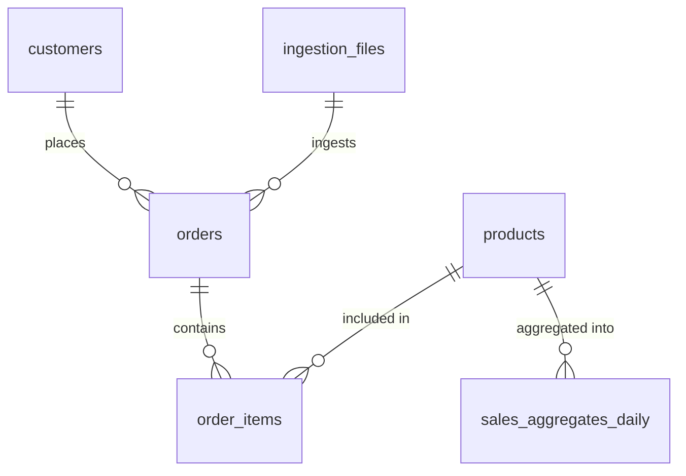

# PipeForge Database Schema

## Entity Relationship Diagram

## Tables

### customers
- `id` (UUID, PK)
- `email_hash` (text) - Hashed customer email for PII protection
- `region` (text) - Customer geographic region
- `first_order_at` (timestamptz) - First order timestamp
- `last_order_at` (timestamptz) - Most recent order timestamp
- `inserted_at` (timestamptz)
- `updated_at` (timestamptz)

**Indexes:**
- `email_hash`
- `region`

### products
- `id` (UUID, PK)
- `sku` (text, unique) - Stock keeping unit
- `name` (text) - Product name
- `category` (text) - Product category
- `base_price` (decimal) - Base product price
- `inserted_at` (timestamptz)
- `updated_at` (timestamptz)

**Indexes:**
- `sku` (unique)
- `category`

### orders
- `id` (UUID, PK)
- `order_ref` (text, unique) - External order reference ID
- `order_date` (timestamptz) - Order timestamp
- `customer_id` (UUID, FK -> customers)
- `total_amount` (decimal) - Total order revenue
- `payment_method` (enum) - mpesa, paystack, card, bank_transfer, other
- `inserted_at` (timestamptz)
- `updated_at` (timestamptz)

**Indexes:**
- `order_ref` (unique)
- `order_date`
- `customer_id`
- `payment_method`

### order_items
- `id` (UUID, PK)
- `order_id` (UUID, FK -> orders)
- `product_id` (UUID, FK -> products)
- `quantity` (integer) - Quantity ordered
- `price` (decimal) - Unit price at time of order
- `subtotal` (decimal) - quantity * price
- `inserted_at` (timestamptz)
- `updated_at` (timestamptz)

**Indexes:**
- `order_id`
- `product_id`

### ingestion_files
- `id` (UUID, PK)
- `filename` (text) - Original filename
- `file_path` (text) - Storage path (MinIO)
- `content_hash` (text, unique) - Content hash for deduplication
- `status` (text) - pending, processing, completed, failed
- `total_rows` (integer) - Total rows in file
- `processed_rows` (integer) - Successfully processed rows
- `failed_rows` (integer) - Failed rows
- `error_message` (text) - Error details if failed
- `started_at` (timestamptz) - Processing start time
- `completed_at` (timestamptz) - Processing completion time
- `inserted_at` (timestamptz)
- `updated_at` (timestamptz)

**Indexes:**
- `content_hash` (unique)
- `status`
- `inserted_at`

### sales_aggregates_daily
TimescaleDB hypertable for time-series analytics.

- `date` (date, PK) - Aggregation date (hypertable partition key, must be in primary key)
- `product_id` (UUID, FK -> products, PK) - Part of composite primary key
- `category` (text, PK) - Part of composite primary key
- `payment_method` (text, PK) - Part of composite primary key
- `total_revenue` (decimal) - Total revenue for the day
- `total_units` (integer) - Total units sold
- `order_count` (integer) - Number of orders
- `unique_customers` (integer) - Unique customers
- `inserted_at` (timestamptz)
- `updated_at` (timestamptz)

**Primary Key:** Composite key `(date, product_id, category, payment_method)` - required by TimescaleDB

**Indexes:**
- `date` (hypertable partition key)
- `product_id`
- `category`
- `payment_method`

**Note:** All primary key fields are NOT NULL. For different aggregation levels, use empty strings or specific values rather than NULL.

## Notes

- All tables use UUID primary keys for distributed system compatibility
- TimescaleDB hypertable on `sales_aggregates_daily` optimizes time-series queries
- Payment method enum ensures data consistency
- Foreign keys use appropriate `on_delete` strategies:
  - `:restrict` for customers/products (prevent deletion if referenced)
  - `:delete_all` for order_items (cascade delete with order)
- PII minimization: customer emails are hashed, not stored in plaintext

